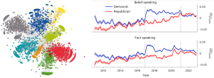
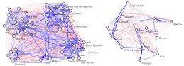
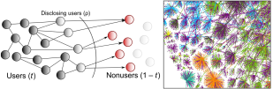
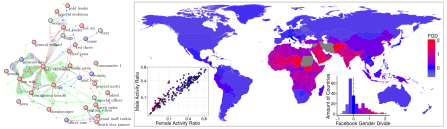

```{r xaringan-themer, include=FALSE, warning=FALSE}
#This block contains the theme configuration for the CSS lab slides style
library(xaringanthemer)
library(showtext)
style_mono_accent(
  base_color = "#5c5c5c",
  text_font_size = "1.5rem",
  header_font_google = google_font("Arial"),
  text_font_google   = google_font("Arial", "300", "300i"),
  code_font_google   = google_font("Fira Mono")
)
```

```{r setup, include=FALSE}
options(htmltools.dir.version = FALSE)
```


layout: true
<div class="my-footer"><span>David Garcia, Social Data Science Lab</span></div> 

---


# About me

.pull-left[
.center[
```{r, echo=FALSE, out.width=270}
knitr::include_graphics("figures/Profile.jpg")
```
]]

.pull-right[
<br>
Website: [dgarcia.eu](https://dgarcia.eu)

Twitter: [@dgarcia_eu](https://twitter.com/dgarcia_eu)

Github: [dgarcia-eu](https://github.com/dgarcia-eu)

Email: david.garcia@uni-konstanz.de
]

- Professor for Social and Behavioral Data Science, University of Konstanz
- Former professor for Computational Behavioral and Social Sciences, TU Graz
- Faculty member of the Complexity Science Hub Vienna
- Privatdozent at ETH Zurich

---

# The Social Data Science Lab Konstanz

.center[]

---

# Computer Science as a Social Science

---

# Bridging Scientific Divides


---

# Bridging Scientific Divides


---

# Bridging Scientific Divides


# From research to education

.center[]

---


# Modelling Online Collective Emotions


- <div style="font-size:18pt"><span>
<a href="https://link.springer.com/article/10.1140/epjb/e2010-00292-1"> An agent-based model of collective emotions in online communities. F. Schweitzer, D. Garcia. The European Physical Journal B (2010) </a>
</span></div>  

- <div style="font-size:18pt"><span>
<a href="http://rsos.royalsocietypublishing.org/content/3/8/160059"> The Dynamics of Emotions in Online Interaction. D. Garcia, A. Kappas, D. Küster, F. Schweitzer. Royal Society Open Science (2016)  </a>
</span></div>  

- <div style="font-size:18pt"><span>
<a href="https://journals.sagepub.com/doi/full/10.1177/0956797619831964"> Collective Emotions and Social Resilience in the Digital Traces After a Terrorist Attack. D. Garcia, B. Rimé. Psychological Science (2019) </a>
</span></div>  

---

# Politics on Social Media

.center[]
- <div style="font-size:17pt"><span>
<a href="https://www.nature.com/articles/s41562-023-01691-w"> 
From alternative conceptions of honesty to alternative facts in communications by US politicians. J. Lasser, S. Aroyehun, F. Carrella, A. Simchon, D. Garcia, S. Lewandowsky. Nat. Human Behavior (2023) </a>
</span></div>  

- <div style="font-size:17pt"><span>
<a href="https://onlinelibrary.wiley.com/doi/abs/10.1002/poi3.82"> Ideological and Temporal Components of Network Polarization in Online Political Participatory Media. D. Garcia, A. Abisheva, S. Schweighofer, U. Serdült, F. Schweitzer. Policy & Internet (2015)</a>
</span></div> 

---

# Social Resilience of Online Communities


.center[]

- <div style="font-size:18pt"><span>
<a href="https://dl.acm.org/doi/10.1145/2512938.2512946"> 
Social resilience in online communities: The autopsy of Friendster. David Garcia, Pavlin Mavrodiev, Frank Schweitzer. First ACM Conference on Online Social Networks (COSN) (2013)  </a>
</span></div>  

- <div style="font-size:18pt"><span>
<a href="https://onlinelibrary.wiley.com/doi/abs/10.1002/poi3.151"> Understanding Popularity, Reputation, and Social Influence in the Twitter Society. David Garcia, Pavlin Mavrodiev, Daniele Casati, Frank Schweitzer. Policy & Internet 9, 3 (2017) </a>
</span></div>  

---

# Polarization and Culture in Eurovision

.center[]

<div style="font-size:18pt"><span>
<a href="https://www.worldscientific.com/doi/abs/10.1142/S0219525913500379">Measuring cultural dynamics through the Eurovision song contest. David Garcia, Dorian Tanase. Advances in Complex Systems (2013) 
  </a>
</span></div>  
---

# Complex Privacy and Shadow Profiles

.center[]

- <div style="font-size:18pt"><span>
<a href="http://advances.sciencemag.org/content/3/8/e1701172.full"> Leaking privacy and shadow profiles in online social networks. David Garcia. Science Advances (2017) </a>
</span></div>  

- <div style="font-size:18pt"><span>
<a href="https://epjdatascience.springeropen.com/articles/10.1140/epjds/s13688-018-0130-3">
Collective aspects of privacy in the Twitter social network.David Garcia, Mansi Goel, Amod Agrawal, Ponnurangam Kumaraguru. EPJ Data Science (2018)  </a>
</span></div>  

---

# Gender Inequality in Online Media

.center[]

- <div style="font-size:18pt"><span>
<a href="https://aaai.org/papers/00131-14522-gender-asymmetries-in-reality-and-fiction-the-bechdel-test-of-social-media/"> Gender Asymmetries in Reality and Fiction: The Bechdel Test of Social Media. D. Garcia, I. Weber, K. Garimella. ICWSM (2014)  </a>
</span></div>  

- <div style="font-size:18pt"><span>
<a href="https://ojs.aaai.org/index.php/ICWSM/article/view/14628"> It's a Man's Wikipedia? Assessing Gender Inequality in an Online Encyclopedia. C. Wagner, . Garcia, M. Jadidi, M. Strohmaier. ICWSM (2015). </a>
</span></div>  

- <div style="font-size:18pt"><span>
<a href="https://www.pnas.org/doi/10.1073/pnas.1717781115"> Analyzing gender inequality through large-scale Facebook advertising data. D. Garcia, Y. Kassa, A. Cuevas, M. Cebrian, E. Moro, I. Rahwan, R. Cuevas. PNAS (2018) </a>
</span></div>  

---

# Health and Polarization in Social Media


<div style="font-size:18pt"><span>
<a href="https://www.thelancet.com/journals/lancet/article/PIIS0140-6736(19)32526-7/fulltext"> EATLancet vs yes2meat: the digital backlash to the planetary health diet. D. Garcia, V. Galaz, S. Daume. The Lancet (2019)  </a>
</span></div>  

---

# Modelling Issue Alignment

.center[]
- <div style="font-size:18pt"><span>
<a href="https://jasss.soc.surrey.ac.uk/23/3/5.html"> A Weighted Balance Model of Opinion Hyperpolarization.  S. Schweighofer, F. Schweitzer, D. Garcia. Journal of Artificial Societies and Social Simulation (2020) 
 </a>
</span></div>  

- <div style="font-size:18pt"><span>
<a href="https://www.jasss.org/27/1/15.html"> Raising the Spectrum of Polarization: Generating Issue Alignment with a Weighted Balance Opinion Dynamics Model. S. Schweighofer, D. Garcia. JASSS (2024) </a>
</span></div>  

---

# Social Media Macroscopes of Emotions

.center[]

- <div style="font-size:18pt"><span>
<a href="https://www.nature.com/articles/s41598-022-14579-y">Validating daily social media macroscopes of emotions. M. Pellert, H. Metzler, M. Matzenberger, D. Garcia. Scientific Reports (2022) </a>
</span></div>  

- <div style="font-size:18pt"><span>
<a href="https://arxiv.org/abs/2107.13236"> Social media emotion macroscopes reflect emotional experiences in society at large. D. Garcia, M. Pellert, J. Lasser, H. Metzler. Arxiv preprint (2021) </a>
</span></div>  

---

# LEIA: Emotion Identification from Text


<div style="font-size:18pt"><span>
<a href="https://epjdatascience.springeropen.com/articles/10.1140/epjds/s13688-023-00427-0"> LEIA: Linguistic Embeddings for the Identification of Affect. Segun Taofeek Aroyehun, Lukas Malik, Hannah Metzler, Nikolas Haimerl, Anna Di Natale, David Garcia. EPJ Data Science (2023)</a></span></div> 


---
# GABM: ABM + LLM


---

## This week: Computational Modelling of Social Systems

- Introduction to Agent-Based Modelling for collective behavior
  - Modeling segregation
  - Modelling collective action
- How to code ABM: first example
  - Granovetter's collective action model
- Opinion dynamics
  - Modelling cultures
  - Modelling consensus, fragmentation, and polarization
- Coding opinion dynamics
  - Bounded confidence and more
  
> **To know more, check www.dgarcia.eu or @dgarcia_eu on Twitter**