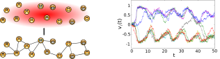

```{r xaringan-themer, include=FALSE, warning=FALSE}
#This block contains the theme configuration for the CSS lab slides style
library(xaringanthemer)
library(showtext)
style_mono_accent(
  base_color = "#5c5c5c",
  text_font_size = "1.5rem",
  header_font_google = google_font("Arial"),
  text_font_google   = google_font("Arial", "300", "300i"),
  code_font_google   = google_font("Fira Mono")
)
```

```{r setup, include=FALSE}
options(htmltools.dir.version = FALSE)
```


layout: true
<div class="my-footer"><span>David Garcia, Social Data Science Lab</span></div> 

---


# About me

.pull-left[
.center[
```{r, echo=FALSE, out.width=270}

```
]]

.pull-right[
<br>
Website: [dgarcia.eu](https://dgarcia.eu)

Twitter: [@dgarcia_eu](https://twitter.com/dgarcia_eu)

Github: [dgarcia-eu](https://github.com/dgarcia-eu)

Email: david.garcia@uni-konstanz.de
]

- Professor for Social and Behavioral Data Science, University of Konstanz
- Former professor for Computational Behavioral and Social Sciences, TU Graz
- Faculty member of the Complexity Science Hub Vienna
- Privatdozent at ETH Zurich

---

# The Social Data Science Lab Konstanz

.center[]

---

# Bridging Scientific Divides


---


# Avoiding Data Piñatas

](figures/Pinata.png)

Also known as kitchen-sink regression, garbage-in garbage-out, and post hoc storytelling. Some patterns will always come out with sufficient data, what matters is making sense of them.

---


# Bridging Scientific Divides


---

# Bridging Scientific Divides


---

# Computer Science as a Social Science

.center[]

---
# From research to education

.center[]

---


# Modelling Online Collective Emotions



- <div style="font-size:20pt"><span>
<a href="https://link.springer.com/article/10.1140/epjb/e2010-00292-1"> An agent-based model of collective emotions in online communities. F. Schweitzer, D. Garcia. The European Physical Journal B (2010) </a>
</span></div>  

- <div style="font-size:20pt"><span>
<a href="http://rsos.royalsocietypublishing.org/content/3/8/160059"> The Dynamics of Emotions in Online Interaction. D. Garcia, A. Kappas, D. Küster, F. Schweitzer. Royal Society Open Science (2016)  </a>
</span></div>  

---

# Collective emotions on social media

.center[]
<div style="font-size:18pt"><span>
<a href="https://journals.sagepub.com/doi/full/10.1177/0956797619831964"> Collective Emotions and Social Resilience in the Digital Traces After a Terrorist Attack. D. Garcia, B. Rimé. Psychological Science (2019) </a>
</span></div>  

---

# Social Media Macroscopes of Emotions

.center[]

- <div style="font-size:18pt"><span>
<a href="https://www.nature.com/articles/s41598-022-14579-y">Validating daily social media macroscopes of emotions. M. Pellert, H. Metzler, M. Matzenberger, D. Garcia. Scientific Reports (2022) </a>
</span></div>  

- <div style="font-size:18pt"><span>
<a href="https://arxiv.org/abs/2107.13236"> Social media emotion macroscopes reflect emotional experiences in society at large. D. Garcia, M. Pellert, J. Lasser, H. Metzler. Arxiv preprint (2021) </a>
</span></div>  

---

# LEIA: Emotion Identification from Text


<div style="font-size:18pt"><span>
<a href="https://epjdatascience.springeropen.com/articles/10.1140/epjds/s13688-023-00427-0"> LEIA: Linguistic Embeddings for the Identification of Affect. Segun Taofeek Aroyehun, Lukas Malik, Hannah Metzler, Nikolas Haimerl, Anna Di Natale, David Garcia. EPJ Data Science (2023)</a></span></div> 


---


# Social Resilience of Online Communities

.center[]

- <div style="font-size:18pt"><span>
<a href="https://dl.acm.org/doi/10.1145/2512938.2512946"> 
Social resilience in online communities: The autopsy of Friendster. David Garcia, Pavlin Mavrodiev, Frank Schweitzer. First ACM Conference on Online Social Networks (COSN) (2013)  </a>
</span></div>  

- <div style="font-size:18pt"><span>
<a href="https://onlinelibrary.wiley.com/doi/abs/10.1002/poi3.151"> Understanding Popularity, Reputation, and Social Influence in the Twitter Society. David Garcia, Pavlin Mavrodiev, Daniele Casati, Frank Schweitzer. Policy & Internet 9, 3 (2017) </a>
</span></div>  

---

# Health and Polarization in Social Media


<div style="font-size:18pt"><span>
<a href="https://www.thelancet.com/journals/lancet/article/PIIS0140-6736(19)32526-7/fulltext"> EATLancet vs yes2meat: the digital backlash to the planetary health diet. D. Garcia, V. Galaz, S. Daume. The Lancet (2019)  </a>
</span></div>  

---

# Modelling Issue Alignment

.center[]
- <div style="font-size:18pt"><span>
<a href="https://jasss.soc.surrey.ac.uk/23/3/5.html"> A Weighted Balance Model of Opinion Hyperpolarization.  S. Schweighofer, F. Schweitzer, D. Garcia. Journal of Artificial Societies and Social Simulation (2020) 
 </a>
</span></div>  

- <div style="font-size:18pt"><span>
<a href="https://www.jasss.org/27/1/15.html"> Raising the Spectrum of Polarization: Generating Issue Alignment with a Weighted Balance Opinion Dynamics Model. S. Schweighofer, D. Garcia. JASSS (2024) </a>
</span></div>  

---


# Models in Machine Learning

A machine learning model is a predictor for unseen data
$$ h_n: \mathbb R^d \rightarrow \mathbb R $$

Fitting: minimize training risk (error) based on loss function $l$
$$ \frac{1}{n} \sum_{i=1}^n l(h(x_i),y_i) $$

Machine Learning aims to minimize **test risk**: same mean loss over an unseen test dataset from the same population as the training dataset

The **capacity** of $\mathcal H$ measures how large is the family that a model belongs to. It is often approximated as the **number of parameters** of $h_n$.

---

# Bias-Variance tradeoff
.center[]
Bias: underfitting (min. training risk), Variance: overfitting (min. test risk)
---

# The double descent
.center[]
[Reconciling modern machine-learning practice and the classical bias–variance trade-off. Mikhail Belkin, Daniel Hsu, Siyuan Ma, and Soumik Mandal (2019)](https://www.pnas.org/doi/10.1073/pnas.1903070116)

---


# Occam's razor?

.center[*"The simplest explanation is usually the best one."*]

What if a simple model is not necessarily the one with the fewer parameters?

$l_2$ norm, also known as Euclidean norm:
$$l_2 = \sum_j^P x_j^2$$
- A model with more parameters could generalize better if their $l_2$ norm is smaller than models with less parameters

- Does the $l_2$ norm also decrease in the second descent?

---

## Double descent example (MNIST) with NN and RF

.pull-left[

]

.pull-right[

]

---

# Norm in RFF for MNIST
.center[]

---

.center[]

---

# Caveats and opportunities

- **Beware of overselling of large models**

- The double descent exists in some problems but it is far from true that it exists in all problems

- Overparametrization requires evidence
  - Careful construction and handling of test samples
  - Out-Of-Domain (OOD) tests
  - If possible: analysis of performance as a function of model size

- **Could Large Language Models (LLMs) work as an interpolation of human behavior in text-based communication?**


---


## From Description to Prescription: ABM + LLM


---

## Agenda: Computational Modelling of Social Systems

- Introduction to Agent-Based Modelling for collective behavior
  - Modelling collective action
- How to code ABM: first example
  - Granovetter's collective action model
- Opinion dynamics
  - Modelling cultures
  - Modelling consensus, fragmentation, and polarization
- Coding opinion dynamics
  - Bounded confidence and more
  
> **To know more, check www.dgarcia.eu or @dgarcia_eu on Twitter**